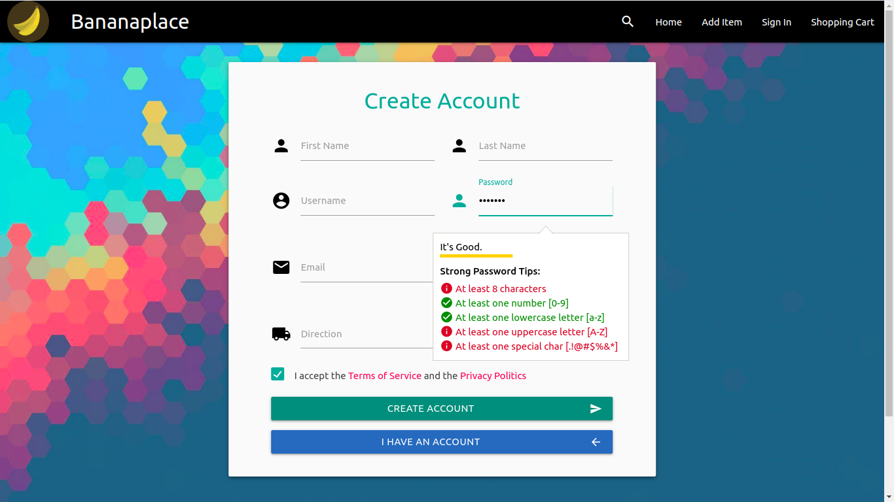

# Bananaplace

This is a small e-commerce/marketplace. Developed as a practice with NodeJS + ExpressJS technologies. Still needs more features to be completed. A dump of the database is included in this repo.

### Demo not available

## Preview of the page (Home).

This is a preview of the homepage, all the products published are listed here on a three tab container.

## Auth / Login / Register / Recover. (Session variables aren't added yet)

The auth forms are all included in one view with a Materialize slider. Tab key is disabled to prevent design breaks.

### Login

### Register

### Password recover

## Profile

The design of this profile view was inspired by GitLab.com's one. You can edit the profile basics here. Also you have a tab to manage all the products posted with your account.

### Profile basics

___

___

### Profile social media

### Profile product management

___

___

Coded with :heart: by [Rubén García](https://rubengarcia.herokuapp.com/)
